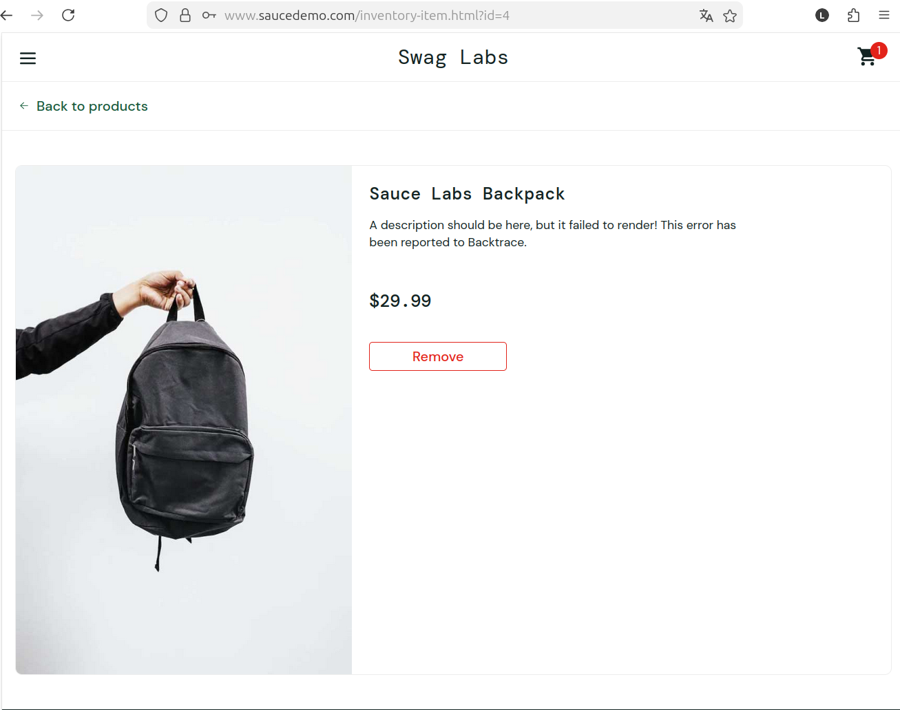
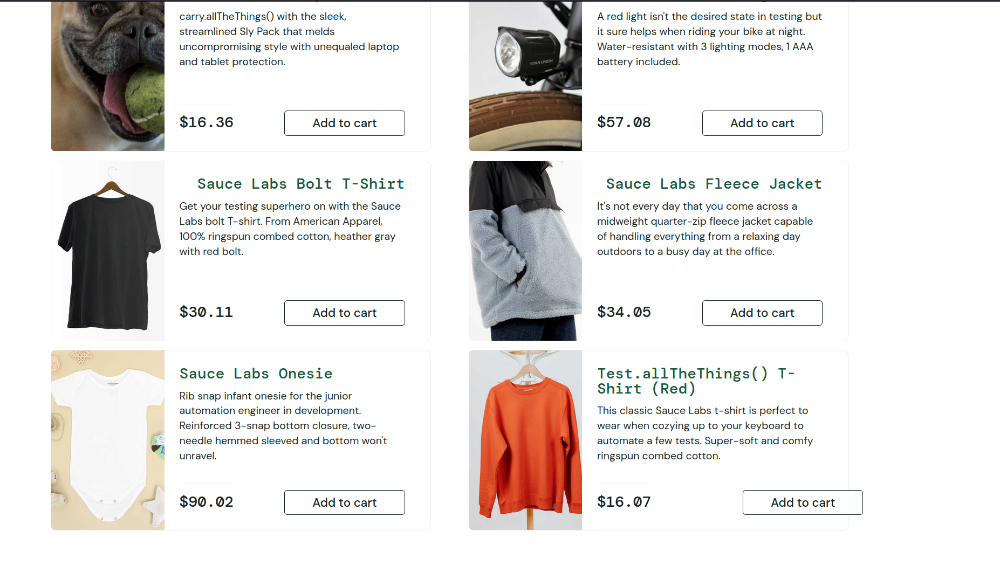
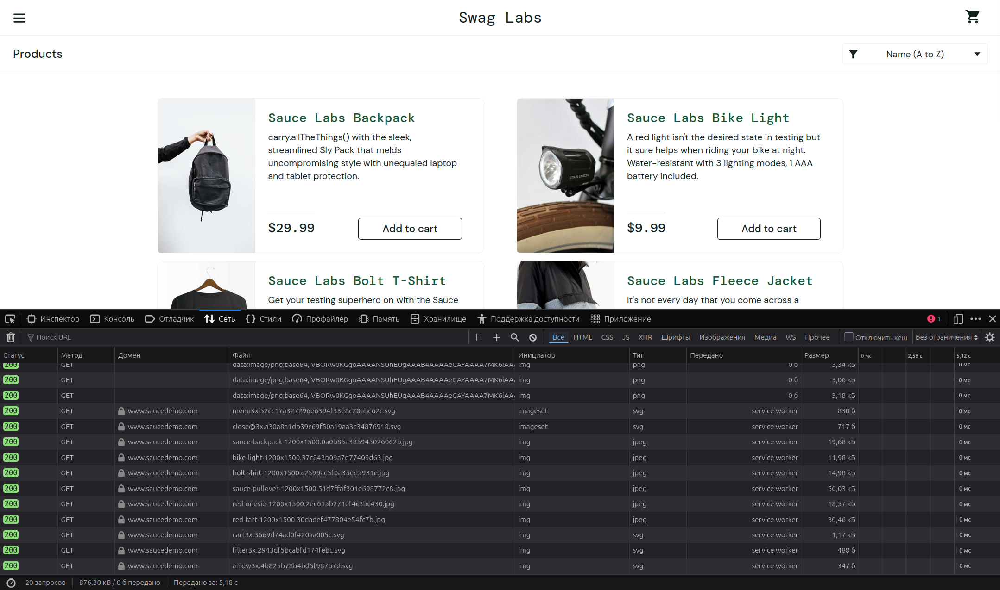

## Анализ дефектов веб-приложения Swag Labs

**Swag Labs** — это учебное веб-приложение, которое используют для практики тестирования.

### **Функциональный дефект**

**Заголовок:**

Функциональный баг. Не получается удалить товар через карточку товара.

**Описание:**

Не работает удаление товара из корзины через карточку товара.

**Приоритет:**

Высокий. 

**Серьёзность:**

S2 — Критическая (Critical).

**Шаги воспроизведения:**

1. ссылка:https://www.saucedemo.com/ --> Usernames: error_user / Password: secret_sauce

2. переходим на страницу товара: Sauce Labs Backpack

3. добавляем товар в корзину, нажав на кнопку "Add to cart"

4. пытаемся удалить товар оставаясь на этой же странице, нажимая на кнопку "Remove"

**Ожидаемый результат:**

При нажатии кнопки "Remove" на странице, товар удаляется из корзины.

**Фактический результат:**

Кнопка "Remove" не "реагирует" на нажатие, статус товара не меняется и товар остается в корзине.

**Вложения:**

### **UI / визуальный дефект**

**Заголовок:** 

Нарушение верстки: кнопка выходит за пределы блока товара.

**Описание:**

Кнопка "Add to cart" отображается неверно для товара "Test.allTheThings() T-Shirt (Red".

**Приоритет:**

Средний.

**Серьёзность:**

S4 — Незначительная (Minor).

**Шаги воспроизведения:**

1. ссылка: https://www.saucedemo.com/ --> Usernames: visual_user / Password: secret_sauce
2. остаемся на главной странице, листаем чуть ниже

**Ожидаемый результат:**

У всех карточек товара одинаковая разметка, кнопка "Add to cart" остается в рамках карточки. 

**Фактический результат:**

У товара "Test.allTheThings() T-Shirt (Red" кнопка "Add to cart" оказалась правее, чем необходимо.

**Вложения:**

### **Дефект производительности**

**Заголовок:** 

Медленная скорость загрузки начальной страницы.

**Приоритет:**

Высокий. 

**Серьёзность:**

S2 — Критическая (Critical).

**Шаги воспроизведения:**

1. ссылка: https://www.saucedemo.com/ --> Usernames: performance_glitch_user / Password: secret_sauce

**Ожидаемый результат:**
Загрузка начальной страницы сайта за 1-3 секунды.

**Фактический результат:**

Скорость загрузки:  5,18 секунд.

**Вложения:**

